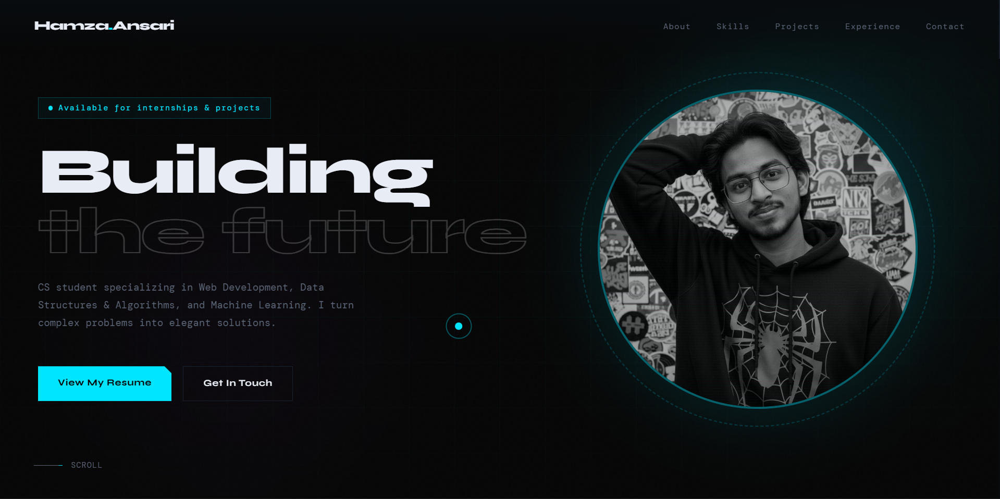

# [H] Hamza Ansari - Interactive Developer Portfolio

A high-performance, cyberpunk-inspired personal portfolio designed to showcase full-stack development skills, projects, and technical experience. Built from the ground up with React, featuring custom scroll animations, a terminal-aesthetic UI, and fully responsive grid layouts.

### 🌐 Live Site: [Insert Live URL Here]

---

## ⚡ Features

* **Custom Scroll Animations:** Utilizes the Intersection Observer API for smooth, staggered element revealing as the user navigates down the page.
* **High-Tech UI/UX:** Features a dark #080c10 theme with glowing cyan (#00e5ff) accents, SVG "laser" timeline segments, and custom noise-texture overlays.
* **Responsive Design:** Fluid typography and spacing using CSS clamp() functions, ensuring flawless rendering from ultra-wide desktop monitors down to mobile screens.
* **Dynamic Project Grid:** Highlights featured full-stack applications (like Next.js/MongoDB platforms and React AI Chatbots) with blueprint-style hover effects.
* **Terminal Aesthetic:** Includes a custom [H] SVG favicon and monospace typographic accents (DM Mono) to emulate a developer environment.

---

## 🛠️ Tech Stack

* **Framework:** React.js
* **Styling:** Tailwind CSS + Custom CSS Modules
* **Icons & Graphics:** Hand-coded SVGs
* **Architecture:** Component-driven design (Abstracted custom hooks)

---

## 💻 Featured Work

1. **NeuralSketch — ML Drawing Classifier** A real-time sketch recognition app powered by a CNN trained on the Quick, Draw! dataset. Achieves 94% accuracy across 50 categories. Built with PyTorch for training and React for the canvas interface.
2. **AlgoViz — DSA Visualizer:** Interactive visualization of 30+ algorithms and data structures with step-by-step animations and complexity analysis.

---

## 👨‍💻 About Me

I am a B.Tech student in Computer Science Engineering specializing in Data Science at Jamia Millia Islamia. I have a strong foundation in Data Structures and Algorithms (Java, C++) and a passion for building robust full-stack web applications. Beyond the terminal, I blend technical execution with visual storytelling through graphic design, videography, and photography.

* **Location:** Delhi, India
* **Interests:** Web Development, Machine Learning, DSA
---

## 🚀 Running Locally

To run this project on your local machine:

1. Clone the repository: `git clone https://github.com/upskill-hamza/portfolio.git`
2. Navigate into the directory: `cd portfolio`
3. Install dependencies: `npm install`
4. Start the development server: `npm run dev` (or `npm start`)

---

*Designed & Built by Hamza Ansari.*
